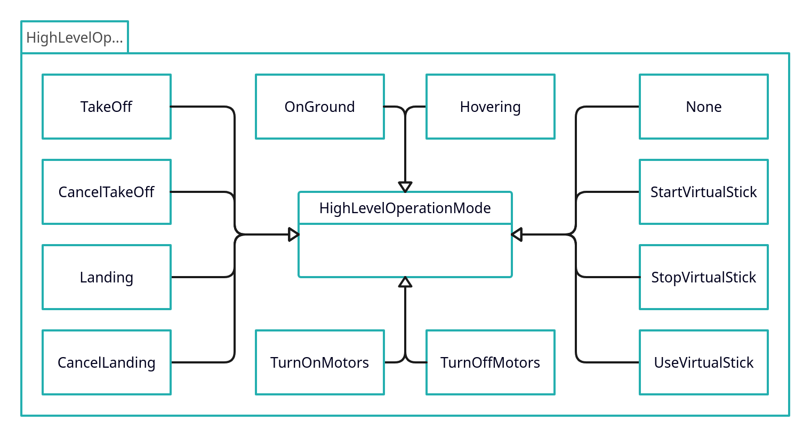
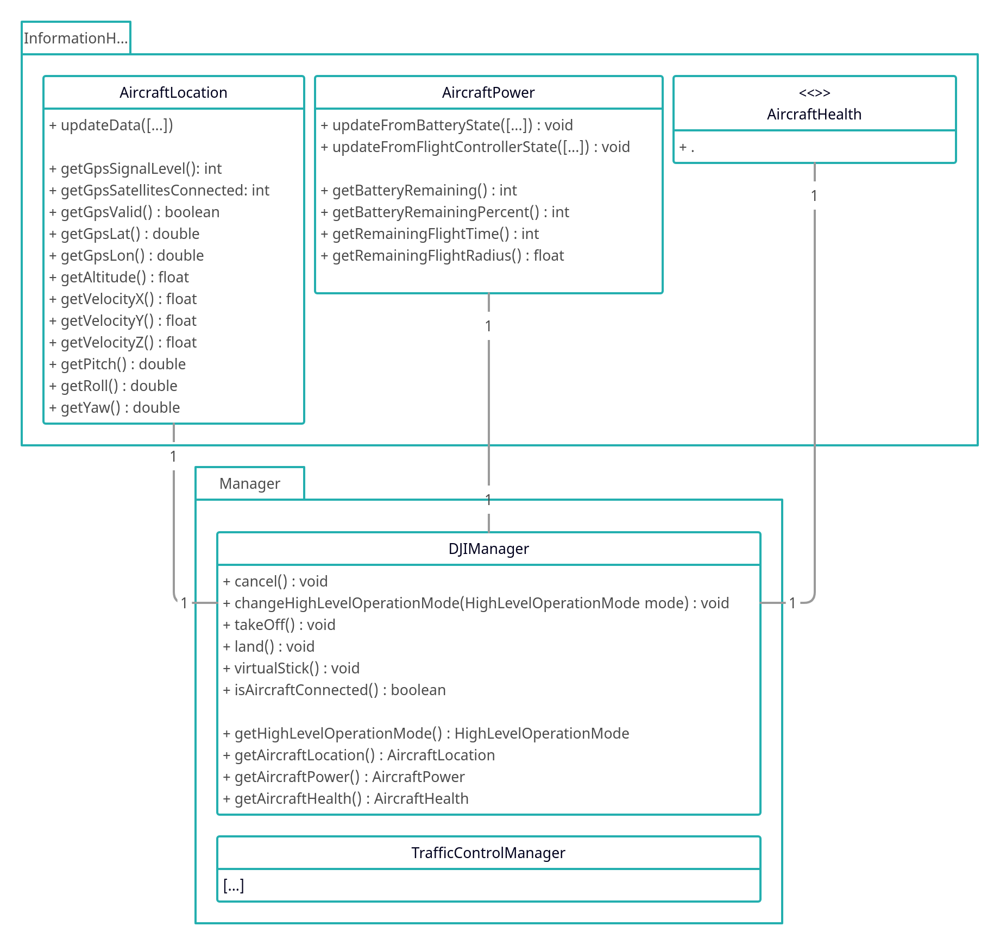

# ADDS-DJI-AndroidApp

## Understanding the App's Code

In this section, a small overview of the parts of the app is given. This should
help you to understand how everything is connected and how the app works from a
very high-level point of view. Have a look at the detailed java documentation
for implementation-specific information.

### Operation Modes

An *Operation Mode* is the (flying) mode the drone is currently in.
This is higher-level than the modes provided by DJI [1], because the
`DJIManager` (inside the `Managers` package) will check if the currently selected
mode can be executed. If so, it will work through the states `start` ->
`attempting` -> `inProgress` -> `finished` (exceptions apply; see `OnGround` and
`Hovering`), issuing the command to the drone and checking if the command is
being executed, finished or if it failed. If an error occured, the state will be
set to `failed`.

Thanks to these modes, the *DJIManager* can detect and automatically recover
from e.g. the pilot taking control of the aircraft. The *DJIManager* can
automatically try to take back control of the drone, so the high-level methods
issuing landing, waypoint missions, ... do not have to worry about these things.

#### Mode States

As mentioned above, an Operation Mode can be in one of the following states:

- `start`: The mode was just started and no command was sent yet.
- `attempting`: The desired command was issued to the DJI MSDK and is currently
                being executed.
- `inProgress`: The MSDK accepted the command with no errors or warnings. The
                drone will now execute the command.
- `finished`: The drone finished the execution. E.g. it is hovering 1,2 meters
              above ground after the takeoff ("takeoff complete").
- `failed`: Something went wrong (multiple times). The *DJIManager* will retry
            the command a few times before setting the state to *failed*.
- `active`: This is a special state for modes that do not have to execute
            anything, e.g. *OnGround* or *Hovering*.

In the following graphic you can see all currently supported modes.

### DJIManager and InformationHolders

The `DJIManager` (inside the `Managers` package) manages the DJI aircraft. It is
an interface between the high-level methods issuing commands like takeoff and
waypoint missions and the DJI MSDK, hence the drone.

The information of the drone (battery state of charge, remaining flight time,
gps location, speed, ...) is saved in three *Information Holder* objects (inside
the `InformationHolders` package), `AircraftLocation`, `AircraftPower` and
`AircraftHealth`, each grouping together a subset of values. The *DJIManager*
registers callbacks to the DJI MSDK, updating the *Information Holders* every
time an update is sent by the DJI MSDK, hence the drone (up to 10Hz [2]). The
*Information Holders* are managed by the *DJIManager* can can be accessed by
public methods.

The connections between the *DJIManager* and the *Information Holders* can be
seen in the following graphic.

## Sources

- [1] [https://developer.dji.com/api-reference/android-api/Components/FlightController/DJIFlightController_DJIFlightControllerCurrentState.html#djiflightcontroller_djiflightcontrollerflightmode_inline](https://developer.dji.com/api-reference/android-api/Components/FlightController/DJIFlightController_DJIFlightControllerCurrentState.html#djiflightcontroller_djiflightcontrollerflightmode_inline) (accessed 2023-02-08 18:30)
- [2] [https://developer.dji.com/mobile-sdk/documentation/introduction/component-guide-flightController.html#state](https://developer.dji.com/mobile-sdk/documentation/introduction/component-guide-flightController.html#state) (accessed 2023-02-08 18:30)