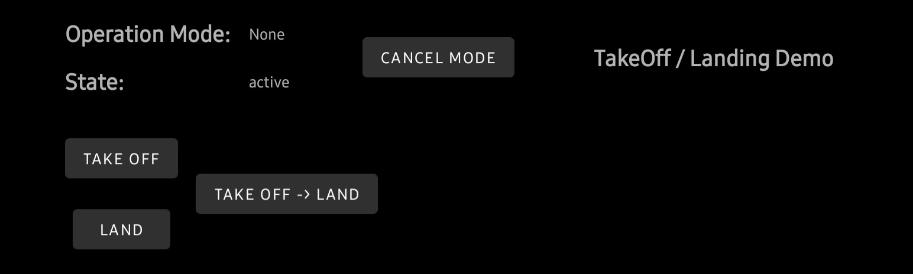
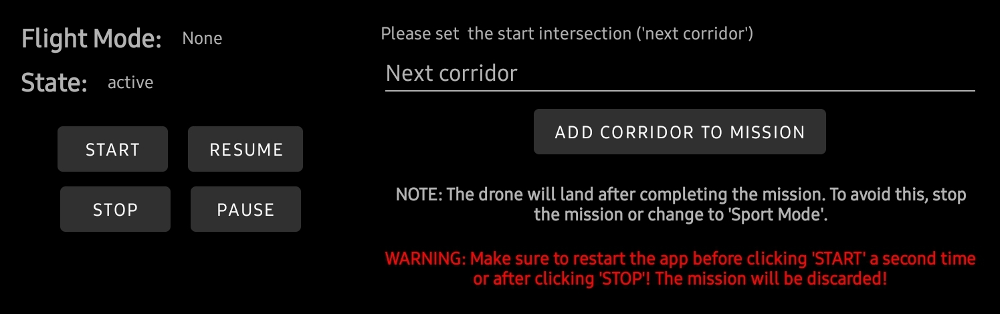

# ADDS-DJI-AndroidApp

## Bridging the Gap: Direct DJI Drone Control for Seamless Integration with the ADDS project

The ADDS-DJI-AndroidApp serves as a key component in the
*Autonomous Drone Delivery System* project ecosystem, managing the
interaction between your drone and the
[ADDS-FlightControl](https://github.com/Andreas-Menzel/ADDS-FlightControl)
service.

**Note:** This application requires the
[ADDS-FlightControl](https://github.com/Andreas-Menzel/ADDS-FlightControl)
service for data management and mission planning.

## Setup

Discover the possibilities of the ADDS-DJI-AndroidApp without needing to connect
to a DJI drone by simply installing the .apk file provided in the releases. This
offers a great way to familiarize yourself with the app's interface and its
features.

However, if you're eager to utilize this app with an actual DJI drone, there's a
minor setup required. You'll need to update the `flightControlUrl` variable to
match your [ADDS-FlightControl](https://github.com/Andreas-Menzel/ADDS-FlightControl)
instance. You can find this variable inside the
`/app/src/main/java/com/andreasmenzel/adds_dji/Managers/FlightControlManager.java`
file:

```java
private final String flightControlUrl = "http://<flight_control_url>:<port>/";
```

After making this adjustment, you're ready to upload the app to your device
using Android Studio. This will enable you to harness the full potential of the
ADDS-DJI-AndroidApp, offering a seamless, efficient, and autonomous drone
control experience.

## How it Works

Upon launch, the ADDS-DJI-AndroidApp verifies all required permissions. Once
these have been granted, you're able to select your drone's ID and then click
"GO FLY" to enter the main screen.


At this stage, the app seamlessly links with the
[ADDS-FlightControl](https://github.com/Andreas-Menzel/ADDS-FlightControl)
service, fetching the existing infrastructure data and initializing automatic
updates if any modifications have been detected.


To ensure the reliability of the ADDS-DJI-AndroidApp and facilitate
comprehensive testing, which is especially important for further development,
multiple testing- and demo-modes have been implemented:

### Takeoff/Landing

Tests the basic takeoff and landing functionality.

See this mode in action: [Youtube](https://youtu.be/yjyHMoYgwBY)



### VirtualStickBasic

This mode facilitates the testing of the DJI Virtual Stick functionality. In
this mode, the app emulates a virtual remote, empowering it with the ability to
control the drone as if manually operated by a pilot.

See this mode in action: [Youtube](https://youtu.be/9rUtqEKblUw)


### VirtualStickCross

Similar to the VirtualStickBasic demo mode, the app also uses a virtual remote.
However, in this case, the app manipulates the virtual joysticks to command the
drone to execute a straightforward X or cross pattern flight path, effectively
providing a more complex demonstration of the drone's capabilities.

See this mode in action (simulated): [Youtube](https://youtu.be/-yoLSRGguAg)

See this mode in action (real-world): [Youtube](https://youtu.be/61h0QPKzlvw)


### BasicWaypointMission

This mode allows you to manually control the drone while marking waypoints
throughout the flight. Once marked, the drone can replicate the trajectory of
your flight by revisiting these waypoints, providing a hands-off demonstration
of the drone's navigational abilities.

See this mode in action: [Youtube](https://youtu.be/g_tqQO5sinE)


### InfrastructureWaypointMission

In the InfrastructureWaypointMission mode, the app not only utilizes the
infrastructure data saved in and managed by the
[ADDS-FlightControl](https://github.com/Andreas-Menzel/ADDS-FlightControl)
service, but also actively communicates with
[ADDS-FlightControl](https://github.com/Andreas-Menzel/ADDS-FlightControl) to
ensure safe and orderly flight operations. Upon selecting the starting
intersection and the list of corridors that the drone should follow, the app
requests flight permissions from the
[ADDS-FlightControl](https://github.com/Andreas-Menzel/ADDS-FlightControl)
service before the drone enters a flight corridor. This ensures that the drone
has the appropriate clearances before it starts navigating along the designated
flight paths, reinforcing the safety and efficiency of operations within the
ADDS ecosystem. This mode offers a comprehensive demonstration of the drone's
autonomous flight capabilities, emphasizing the integration and interactivity
between the drone, the app, and the
[ADDS-FlightControl](https://github.com/Andreas-Menzel/ADDS-FlightControl)
service.

See this mode in action: [Youtube](https://youtu.be/0oiUxM2VdOI)



### AdvancedWaypointMission

In the AdvancedWaypointMission mode, the app takes drone automation to a new
level. Here, you only need to specify the destination intersection. Once the
destination is set, the app communicates with the
[ADDS-FlightControl](https://github.com/Andreas-Menzel/ADDS-FlightControl)
service to request a suitable flight path.

The
[ADDS-FlightControl](https://github.com/Andreas-Menzel/ADDS-FlightControl)
service calculates the most efficient route for the drone to
follow, which is typically the shortest and fastest path. In instances where the
optimal path is unavailable due to other drones currently using or having
reserved certain sections of the route, the
[ADDS-FlightControl](https://github.com/Andreas-Menzel/ADDS-FlightControl)
system has the functionality to navigate around these constraints. It
accomplishes this by calculating an alternate route that avoids the occupied
corridors, thus ensuring the continuity of drone operations.

This mode represents the heart of the Autonomous Drone Delivery System, where
complex path planning, real-time traffic management, and autonomous control come
together to create a sophisticated and reliable drone navigation solution.

See this mode in action: [Youtube](https://youtu.be/OemlvOYHL6Q)


## Feedback

Your feedback and suggestions are always welcome. Please feel free to raise an
issue, submit a pull request, or contact me directly.

Disclaimer: Please remember that this software is provided 'as is', with no
guarantees of suitability for any particular purpose or warranties of any kind,
either expressed or implied.
